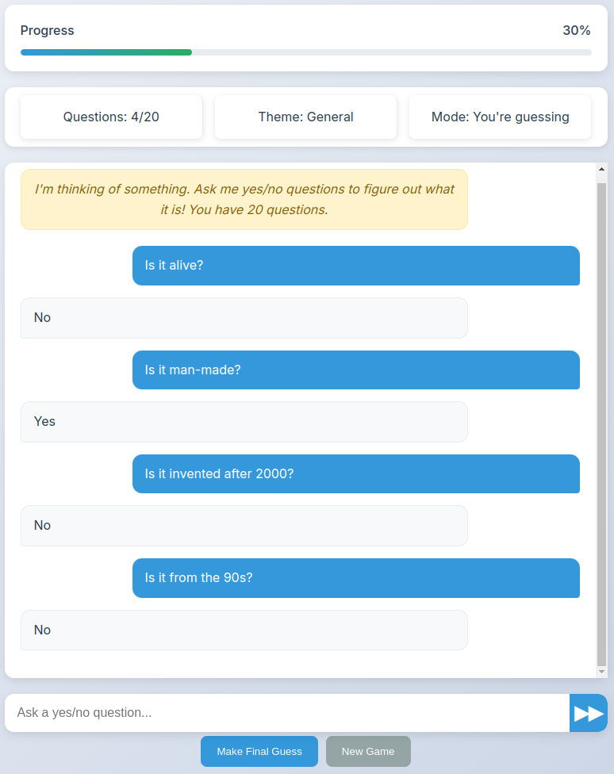
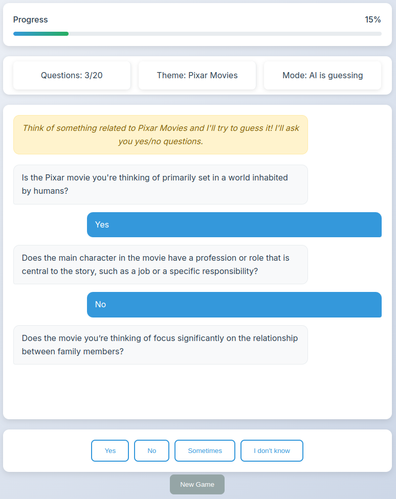
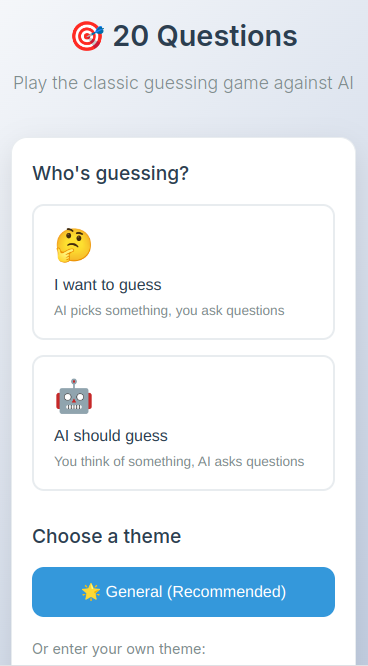

# 20 Questions AI Game: An Interactive AI-Powered Guessing Game


## Introduction

This project is a modern take on the classic "20 Questions" guessing game, powered by AI. It allows you to play either as the guesser or the answerer, challenging an AI to guess your object or guessing the AI's chosen object by asking yes/no questions. This interactive game showcases AI integration, natural language processing, and dynamic gameplay mechanics, making it a perfect addition to an AI engineer's portfolio.

## Gameplay Overview

The game offers two modes:

- **User Guesses:** The AI picks an object based on the selected theme and difficulty, and the user asks yes/no questions to guess it within 20 questions.
- **AI Guesses:** The user thinks of an object, and the AI asks yes/no questions to guess it.

### Theme Selection

Players can choose a general theme or enter a custom theme. The general theme is recommended and must be selected by clicking the blue button, which then turns green to indicate activation before starting the game.

### Asking Questions and Making Guesses

In user guess mode, the player types yes/no questions, and the AI responds truthfully with "Yes", "No", or "Sometimes". The AI carefully avoids lying and provides accurate answers based on the chosen object.



In AI guess mode, the AI asks strategic yes/no questions, and the player responds using buttons for "Yes", "No", "Sometimes", or "I don't know". The AI uses the conversation history to make informed guesses.



## Key Features and Technical Highlights

- **AI Integration:** The game uses OpenAI's API to generate objects, validate themes, and respond to questions, ensuring dynamic and engaging gameplay.
- **Theme Validation:** Custom themes are validated for family-friendliness using AI to maintain appropriate content.
- **Difficulty Levels:** Three difficulty levels adjust the complexity of objects and questions.
- **Progress Tracking:** The game estimates progress toward guessing the object using AI analysis of the conversation.
- **Responsive UI:** The interface adapts to different screen sizes and devices for a smooth user experience.
- **Score Management:** Tracks games played and won, with local storage persistence.

## Code Snippets

### Game State Management and Initialization

```javascript
class TwentyQuestionsGame {
    constructor() {
        this.gameState = {
            mode: null, // 'user-guesses' or 'ai-guesses'
            theme: 'General',
            difficulty: 2,
            questionCount: 0,
            maxQuestions: 20,
            conversation: [],
            gameActive: false,
            currentObject: null,
            progress: 0
        };
        // Initialization code omitted for brevity
    }
    // More methods...
}
```

### Theme Selection and Validation

```javascript
selectGeneralTheme() {
    const btn = document.getElementById('general-theme-btn');
    btn.classList.add('selected');
    this.gameState.theme = 'General';
    this.checkStartButtonState();
}

async validateThemeWithAI(theme) {
    const response = await callOpenAI([{
        role: 'system',
        content: `Is "${theme}" appropriate for a family-friendly 20 questions game?`
    }]);
    return response.trim().toUpperCase() === 'YES';
}
```

### AI Asking Questions

```javascript
async askAIQuestion() {
    if (this.gameState.questionCount >= this.gameState.maxQuestions) {
        this.endGame(false, "I couldn't guess it in 20 questions!");
        return;
    }
    const response = await callOpenAI([{
        role: 'system',
        content: `You are playing 20 questions. Ask a yes/no question based on previous conversation.`
    }]);
    this.addMessage('ai', response);
    this.gameState.questionCount++;
    this.updateQuestionCount();
}
```

## Prompting Strategies

- The AI is instructed to be creative and avoid repeating common or recent objects.
- Questions and answers are constrained to yes/no/sometimes to maintain clarity.
- The AI uses conversation history to build strategic questions and guesses.
- Theme validation ensures family-friendly content by filtering inappropriate themes.

## Screenshots

### Initial Setup Screen


### Mobile View



### Theme Selection with General Theme Activated


## Conclusion

This 20 Questions AI game demonstrates the power of combining classic gameplay with modern AI capabilities. It highlights prompt engineering, state management, and user interaction design, making it a compelling project for any AI engineer portfolio.

---

*Project repository:* [GitHub - nikola-sur/twenty-questions](https://github.com/nikola-sur/twenty-questions)
